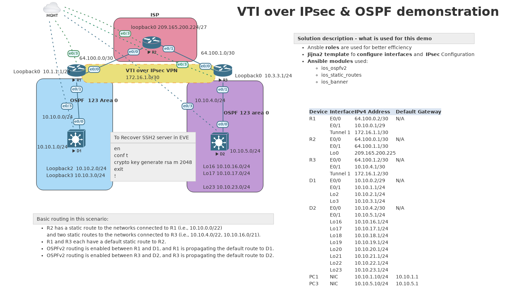

# Ansible VTI over IPSec and OSPF distribution through tunnel

#### Short summary
Eve-ng topology is stored in **eveng/** directory. I used eve-ng pro version. Please use Python virutal Environments.This was compiled to support ansible 2.13.5 version. Backups are stored in backups/ dir.

#### Please use Python venv
`source venv/bin/activate`

#### Topology

 

#### How to push configuration with Ansible playbook(s). 

It requreis to execute only a single command:

    `ansible-playbook full_config.yml`

You can also run just verification playbook (which is also included in full_config.yml script) by executing:
    `ansible-playbook show_commands.yml`

####For this lab I use:
  *  jinja2 template to configure interfaces as well as IPsec settings
  * ios_ospfv2 module
  *  ios_static_routes module
  *  ios_banner

##### Device variables for R1 rotuer.

``` yaml
interfaces:
 - name: Ethernet0/0
   description: Link to R2 configured by Ansible
   ipv4: 64.100.0.2/30
  #  ipv6: 2001:db8:acad:12::1/64
  #  link_local: fe80::12:1

 - name: Ethernet0/1
   description: Link to D1 configured by Ansible
   ipv4: 10.10.0.1/29
  #  ipv6: 2001:db8:acad:11::1/64
  #  link_local: fe80::11:1
   cdp: 'no'

#  - name: Tunnel 1
#    description: Link to D1 configured by Ansible
#    ipv4: 172.16.1.1/30


#IPSec Config Section   
Tunnels:
  - name: Tunnel 1 
    ipv4: 172.16.1.1/30
    src: "64.100.0.2"
    dest: "64.100.1.2"
    mode: "ipsec ipv4"
    protection: "ipsec" 
    vti_profile: "VTI_PROFILE"
    mtu: 1400
    bandwidth: 4000
  # To add another tunnel just uncomment and adjust accordingly
  # - name: Tunnel 2 
  #   ipv4: 172.162.1.1/30
  #   src: "164.100.0.222"
  #   dest: "164.100.1.222"
  #   mode: "ipsec ipv4"
  #   protection: "ipsec" 
  #   vti_profile: "VTI_PROFILE2"
  #   mtu: 1400
  #   bandwidth: 3000

crypto_isakmp:
  policy: 10
  encr: aes
  hash: sha256
  auth: pre-share
  dh_gr: 14
  lifetime: 3600
  key: cisco123 

trset:
  name: VTI_VPN
  mode: tunnel

# OSPF config data
ospf:
  process_id: 123
  router_id: 1.1.1.1
  default_orignate: "True"
  auto_cost:
    reference_bandwidth: 1000
ospf_networks:
    - address: "10.10.0.0"
      wildcard_bits: "0.0.0.3"
      area: "0"
    - address: "10.10.0.0"
      wildcard_bits: "0.0.0.3"
      area: "0"

# Additional static routes
routes:
  - route: 1
    dest: "0.0.0.0/0"
    nexthop: "64.100.0.1"
    name: "Default_to_R2"

#ip route 0.0.0.0 0.0.0.0 64.100.0.1

```


##### Jinja2 template for interface configuration

```jinja2
#jinja2: lstrip_blocks:True, trim_blocks:True

interface {{ intf.name }}

   description {{ intf.description }} 


   no switchport


   ip address {{ intf.ipv4 | ipaddr('address') }} {{ intf.ipv4 | ipaddr('netmask')}}


   ipv6 address {{ intf.ipv6 }}


   ipv6 address {{ intf.link_local}} link-local


   no cdp enable

   no shutdown

```
#### Main taks to configure router interfaces.
``` yaml
---
# Tasks file for rtr_interfaces

- name: " Build IOS interface config "
  ansible.builtin.template:
    src: "interfaces.j2"
    dest: "config/{{ inventory_hostname }}_interface_config_lstrip.txt"

- name: " Send interface interface basic config to device(s)"
  cisco.ios.ios_config:
    src: "config/{{ inventory_hostname }}_interface_config_lstrip.txt"
    backup: "yes"
    save_when: "modified"
```

#### Role/Task to apply IPSec settings
``` jinja2
- name: "Configure IPSec: transform set, Crypto ISAKMP, Tunnels"
  cisco.ios.ios_config:
    backup: no
    src: vti_config.j2

```

#### Template for IPsec settings.

``` jinja2

crypto isakmp policy {{ crypto_isakmp.policy }}
 encr {{ crypto_isakmp.encr }}
 hash {{ crypto_isakmp.hash }}
 authentication {{ crypto_isakmp.auth}} 
 group  {{ crypto_isakmp.dh_gr}}
 lifetime {{ crypto_isakmp.lifetime}} 



crypto ipsec transform-set  {{ trset.name }} esp-aes esp-sha256-hmac 
 mode {{ trset.mode}} 




crypto ipsec profile {{ tunnel. vti_profile }}
 set transform-set {{ trset.name }}

crypto isakmp key {{ crypto_isakmp.key }} address {{ tunnel.dest }} 
crypto isakmp invalid-spi-recovery


interface {{ tunnel.name  }}
 no shutdown
 bandwidth {{ tunnel.bandwidth }}
 ip address {{ tunnel.ipv4 | ipaddr('address') }} {{ tunnel.ipv4 | ipaddr('netmask')}}
 ip mtu {{ tunnel.mtu }}
 tunnel source {{ tunnel.src }}
 tunnel mode {{ tunnel.mode }}
 tunnel destination {{ tunnel.dest }}
 tunnel protection ipsec profile {{ tunnel.vti_profile }}


router ospf {{ ospf.process_id }}
 network {{ tunnel.ipv4 | ipaddr('network') }} {{ tunnel.ipv4 | ipaddr('wildcard')}} area 0
exit


 




```
